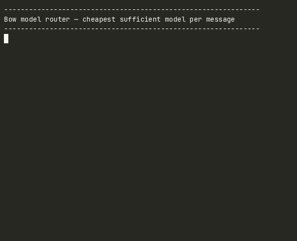
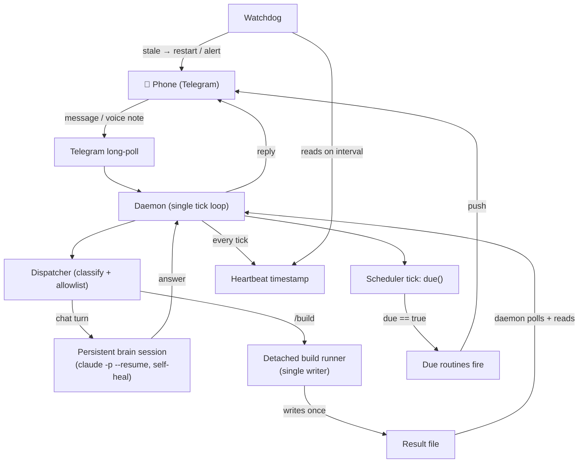
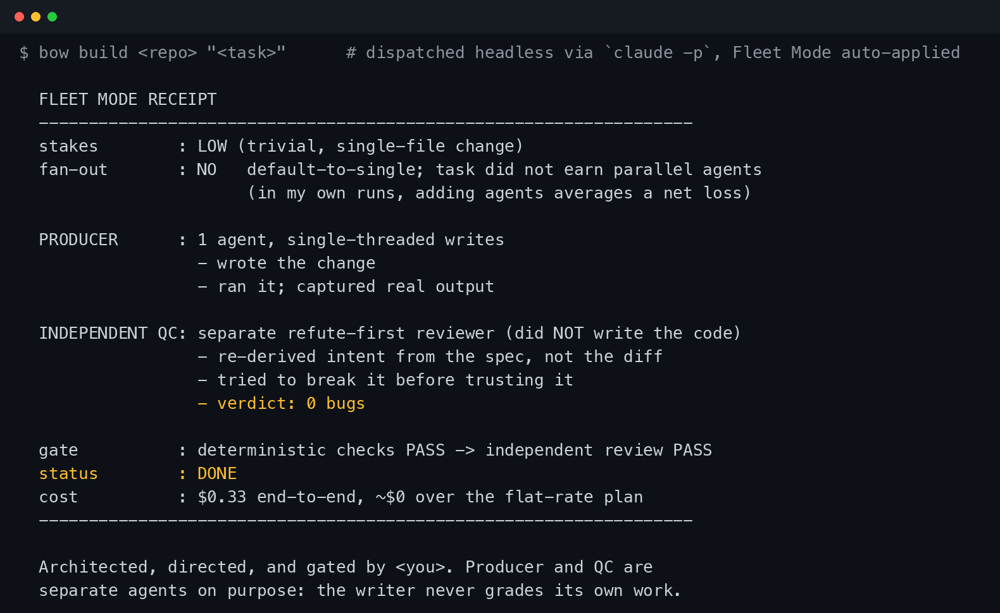
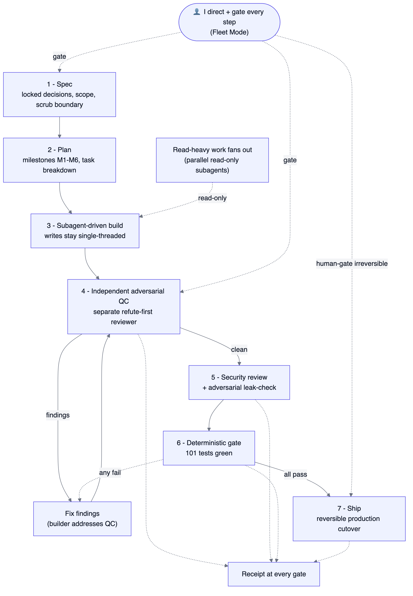
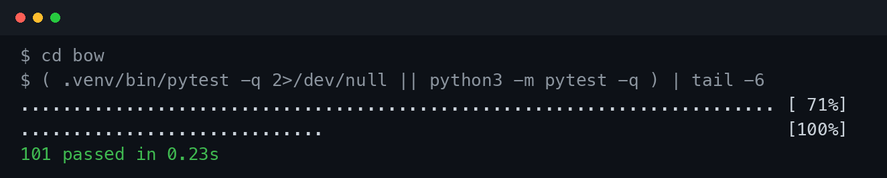
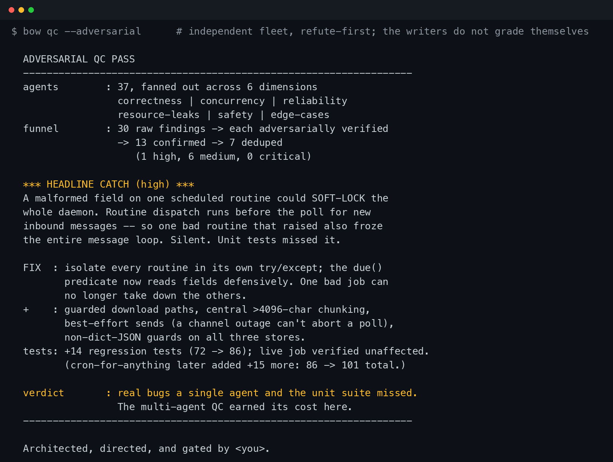
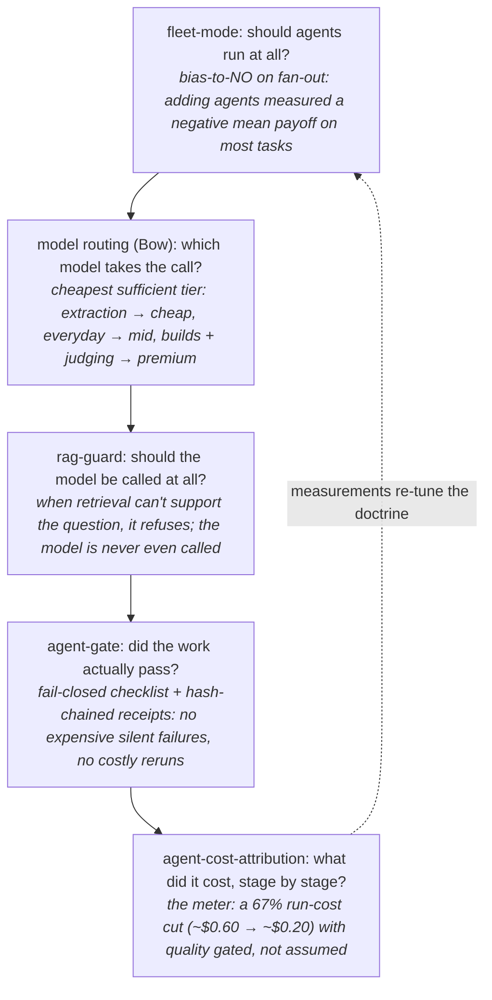

# Bow: guardrail patterns for headless Claude Code agents, and the system they run in

[](LICENSE)
[](https://www.python.org/)
[](https://github.com/Jott2121/bow/actions/workflows/ci.yml)
[](https://github.com/Jott2121/bow/actions/workflows/codeql.yml)
[](docs/CASE-STUDY.md)
[](docs/FLEET-MODE.md)

I direct fleets of Claude agents to build production systems, then gate their work with adversarial review. These three patterns came out of one of those systems.

**Three guardrail patterns for headless Claude Code agents that must not die at the usage wall. Runnable, stdlib-only, shipped with the production tests. Steal them.**

| Pattern | The failure it prevents | Receipt |
|---|---|---|
| [Budget governor](patterns/budget_governor/) | your agent dies mid-task when the shared usage cap runs dry | defers with a note, catches up automatically; the full wall lifecycle proven live on the real ledger |
| [Proactive compactor](patterns/proactive_compactor/) | session rotation loses your agent's memory, or stalls a reply for minutes | $0.23 per background brief; instant rotations |
| [Escalation valve](patterns/escalation_valve/) | your cheap model grinds on a hard call it should hand up | one consult per hard call; autopilot triggers live-verified, every consult receipted in an append-only ledger |

```bash
git clone https://github.com/Jott2121/bow && cd bow
python3 -m pytest patterns/ -q   # 32 tests, under 2 seconds, zero live calls
```

```
$ python3 -m pytest patterns/ -q
32 passed in 0.02s
```

One of these patterns exists because a three-call experiment disproved the design I was about to build: [resume does not fork](patterns/proactive_compactor/RESUME-DOES-NOT-FORK.md).

Below the fold: the case study of the system they run in, the orchestration doctrine that built it, and the gates that caught the bugs my tests missed. That part is the resume. This part is the loot.

---

**An all-Claude (Opus 4.8) chief-of-staff agent I architected, built, and run. Reachable from my phone, at about $0/mo marginal cost.**

`24 modules` · `382 tests` · `6 milestones shipped` · `~$0/mo`

*Those are the live private system's numbers as of June 2026. The raw artifacts in `assets/` are the launch snapshot (16 modules, 101 tests) and match those receipts exactly. The CI badge above covers this public repo only; the 382-test suite runs in the private repo.*

> ⭐ **Fleet Mode**: my original agent-orchestration doctrine, running as a live skill (see [docs/FLEET-MODE.md](docs/FLEET-MODE.md)).

> 🧩 **Bow is the flagship of one system, not one of five projects**: five public repos form a single [cost-governance stack](#the-system-a-cost-governance-stack) for operating AI agents cost-efficiently, with receipts.

> A single always-on daemon wraps the headless `claude -p` CLI as first-party usage, routes my phone messages, runs autonomous builds, fires scheduled routines, and self-heals. Built and adversarially reviewed by fleets of Claude subagents I directed and gated.

This repo is a sanitized engineering case study, not a runnable clone. The proof is the architecture, an original orchestration doctrine, real annotated code, the build process, and honest receipts. Tone throughout: receipts over hype.

**The one thing to take away:** this is an AI-built system where my value-add is the *orchestration doctrine and the gates*, not the typing. I architected it, then directed and gated fleets of Claude (Opus 4.8) subagents to implement and adversarially review every piece. The gates earned their keep with real bugs caught, not assertions. The sharpest single instance: an independent QC pass caught a malformed-routine field that could **soft-lock the entire daemon**, a failure the happy-path unit tests never saw. Directing agent fleets to ship *correct* work, with the gates proving it, is the competency on display.

The cost bet below is the architecture decision that makes it cheap; the orchestration is the skill.



---

## How to read this repo

Two layers, depending on why you are here.

- **Here for the loot (reusable code):** the three patterns in [`patterns/`](patterns/) are runnable, stdlib-only, and shipped with their production tests. Clone and run `python3 -m pytest patterns/ -q`. Start with the table at the top.
- **Here to evaluate the engineering:** read sections 1 through 8 below. They are the case study of the live system these patterns came out of. The short version is [`docs/CASE-STUDY.md`](docs/CASE-STUDY.md).
- **Here for the orchestration doctrine:** section 3 and [`docs/FLEET-MODE.md`](docs/FLEET-MODE.md). That is the actual skill on display, directing and gating agent fleets, not the typing.
- **Here for proof:** [`assets/`](assets/) holds the real receipts (test runs, daemon logs, the QC catch), and section 7 is the honest scorecard, including what does not work.

What this repo is not: a runnable clone of the private system. It is a sanitized case study. The architecture, the doctrine, the annotated patterns, and the receipts are the point.

---

## 1. What it is (30 seconds)

I ran an earlier multi-provider personal agent. It died on auth, `HTTP 400: "You're out of extra usage"`, because a flat-rate subscription credential can't legally serve a *third-party* agent's API traffic; that traffic gets metered, and when the balance hits zero, the agent stops. The only honest fix inside that design is a real metered API key, and for a do-everything assistant that runs all day, that is real money every month.

So I rebuilt it on a different bet:

> **Don't call the API. Be the tool.**

Instead of an agent that makes metered third-party API calls, Bow *is* a first-party Claude Code user. The whole system is a thin, disciplined wrapper around the headless `claude -p` CLI. The brain is a persistent `claude -p --resume` session, so it inherits my real skills, memory, MCP servers, and tools for free (no rebuild) and bills under the flat-rate plan I already pay for instead of a separate metered key. One AI (Claude, Opus 4.8), not a two-provider stack.

Bow runs two real workloads in production: a daily scheduled quantitative job and a personal knowledge base. Both are described generically on purpose. The point is the architecture, not the payloads.

As above, the agents built it under my direction and my gates, under a doctrine I'd already shipped as a skill: **Fleet Mode** (section 3). Bow is an all-Claude system; the cost bet is *what* it's built on, the orchestration is *how* it was built correctly.

---

## 2. Architecture

A single tick loop is the only event source. The build path crosses a process boundary through one file with one writer. Liveness is judged by an independent watchdog rather than self-reported.



Full component responsibilities, the data flow, and the four hard decisions that actually cost me time are in **[docs/ARCHITECTURE.md](docs/ARCHITECTURE.md)**.

---

## 3. ⭐ Fleet Mode: the orchestration doctrine

This is the top-billed part. Fleet Mode is the small set of rules I converged on for running fleets of Claude (Opus 4.8) subagents that earn their keep instead of burning spend on theater. It runs as a live Claude Code skill on the machine that builds Bow, so every headless build auto-applies it.

The load-bearing fact of the entire doctrine, measured in my own runs (not a borrowed benchmark):

> **Default to a single agent. Adding agents has a negative average payoff across tasks; fan out only for read-heavy parallel work that demonstrably earns it.**

The four sub-rules, in short:

1. **Read-heavy work fans out.** Fan-out is for *reading*: research across many sources, auditing a codebase, where each subagent explores in a clean context and returns a tight, condensed summary. Not for acting.
2. **Writes stay single-threaded.** One agent makes the edit, always. Extra agents add *intelligence* to a write (review it, pressure it), never *parallel actions*. Parallel writers race and clobber.
3. **Deterministic machine checks first, then an independent refute-first reviewer.** Tests, types, lint, and re-derived numbers run before any model looks at the work. Only then does a reviewer in a separate clean context try to *break* it. No agent grades its own homework. The gate fails closed.
4. **Default-to-no, anchored on the negative-average finding.** Every reach for another agent puts the burden of proof on the agent. The task has to *demonstrably* earn the fan-out or it doesn't get it.

There's an honest provenance beat in the full doc: after I had Fleet Mode running as my default, the labs shipped essentially the same idea ("ultracode"). I'm not claiming I invented something they copied. I'm claiming I arrived at it independently, from the same pressure, before it had a product name. When you operate agent fleets seriously and adversarially, you converge on the rules the work actually rewards.



*A hand-formatted summary of Fleet Mode firing on a real build. The doctrine is operational, not an essay.*

Full treatment: **[docs/FLEET-MODE.md](docs/FLEET-MODE.md)**.

---

## 4. Components & key decisions

| Component | Its one job | The non-obvious call |
|---|---|---|
| **Daemon + long-poll** | The single always-on loop: pull messages, route, tick the scheduler, emit a heartbeat. | The long-poll loop is the *only* event source. Everything funnels through one tick, so there is exactly one thread of control to reason about, and the tick must never block. |
| **Dispatcher** | Classify each inbound message and hand it to the right path. | Commands are gated by a chat allowlist, not the model's judgment. In a single-user threat model the allowlist is the load-bearing security boundary, enforced deterministically before the model is invoked. |
| **Detached single-writer build runner** | Run an autonomous headless build to completion out-of-band, then report back. | A build is spawned **detached** (it outlives the tick) and is the **sole writer** of its own result file; the daemon only reads. One writer per file means no torn-write race. → [`snippets/single_writer_dispatcher.py`](snippets/single_writer_dispatcher.py) |
| **Scheduler `due()`** | Decide which routines fire this tick (cron, interval, or daily time-of-day + weekday). | The whole fire/don't-fire decision is a **pure function** (no clock reads, no I/O), so every edge case is unit-testable. Interval and daily routines catch up after the machine sleeps (`due()` re-evaluates on wake); cron fires only within its matching minute by design, so a 9:30 cron job slept through is intentionally not back-fired at 10:15. → [`snippets/scheduler_due.py`](snippets/scheduler_due.py) |
| **Watchdog + heartbeat** | Detect a silent daemon death and self-restart / alert, independent of the daemon. | Liveness is decided by an outside observer, not self-reported. A hung daemon can't honestly report it's healthy. |
| **Brain / persistent session** | One durable conversation with continuity across restarts. | Continuity is the persisted `--resume` session id; a dead session **self-heals** into a fresh one instead of erroring at whoever's texting. Wrapping real `claude -p` means it inherits skills, memory, and tools for free. → [`snippets/session_self_heal.py`](snippets/session_self_heal.py) |

Three of the four hard decisions were macOS-specific and only surfaced under `launchd`: relocating the working tree off a TCC-protected home directory, using launchd wrapper scripts instead of `EnvironmentVariables`, and the fact that headless `claude -p` authenticates where an interactive keychain unlock fails. Details in [docs/ARCHITECTURE.md](docs/ARCHITECTURE.md).

---

## 5. Reliability & security

Each guard exists because the adversarial QC pass found the failure it prevents, not because I anticipated it on the happy path.

- **Watchdog / heartbeat self-restart.** The daemon writes a heartbeat every tick; a separate watchdog restarts it if that goes stale. (An early version crashed on a *missing* heartbeat by computing `int(inf)`; the adversarial review caught it before it shipped.)
- **Session self-heal.** A dead `--resume` session id falls back to a fresh session instead of surfacing a raw "no conversation found" error to the phone. → [`snippets/session_self_heal.py`](snippets/session_self_heal.py)
- **The single-writer race avoided.** Two processes writing one shared JSON file with no lock is a torn write waiting to happen: intermittent, data-dependent, invisible until production. I refused to ship it. Each build is the sole writer of its own result file; the daemon is a pure reader. → [`snippets/single_writer_dispatcher.py`](snippets/single_writer_dispatcher.py)
- **A path-traversal hole, found and closed.** The independent security review flagged an unsanitized inbound path; it was closed before anything went live.
- **Routine isolation.** Routine dispatch ran *before* the message fetch each tick, so one malformed routine raising an exception soft-locked the *entire* daemon, every tick, freezing the phone channel too. Now each routine is isolated in its own try/except and `due()` reads its fields defensively. → [`snippets/daemon_resilience.py`](snippets/daemon_resilience.py)
- **No live vulnerabilities** for the single-user threat model after the review and fixes. Zero critical findings remaining.
- **`bypassPermissions` is a documented, gated, accepted risk.** Queued builds run with permissions bypassed (the security review rated this HIGH). I did *not* silently ship it: the chat allowlist is the load-bearing gate, a sandbox is a deferred item, and the trade-off is written down. An honest "accepted risk, here's the mitigation" beats a hidden one.

**The July hardening arc.** A follow-on week after the launch build, same discipline applied to the system itself: a blind pre/post bench on a skill-mining pass that landed exactly at its own pre-committed threshold (flat by the letter of the rule, kept anyway on an honest direction-and-floor argument), an escalation valve for hard calls that uses an append-only receipts ledger instead of a hard cap, a budget governor that parses its own cooldown out of the provider's rate-limit error text, and a proactive compactor whose first design got killed by a three-call experiment before the wrong version got built. Plus three bugs that a clean review and a green test suite both missed and only live verification caught. Full writeup: **[docs/RELIABILITY-WEEK.md](docs/RELIABILITY-WEEK.md)**.

---

## 6. Engineering process

Spec → plan → subagent-driven build → **independent adversarial QC** → security review → full test pass → reversible production cutover. Every milestone passed a deterministic check (tests, a live invocation) *and* a separate refute-first review before I let myself write "shipped."



*The process as a diagram: read-heavy work fans out, writes stay single-threaded, and every gate emits a receipt. I gate the irreversible steps myself.*



*The deterministic gate at launch: the full suite green (101 tests at launch; the private live system is at 382 as of June 2026). Raw `pytest` output, not a summary.*

Most of this landed inside one focused session, which is mechanically unremarkable once you see how: fleets of Claude subagents did the implementation in parallel, under my direction and my gates. I wasn't typing 1,025 lines by hand; I was classifying stakes, fanning out read-heavy work, keeping writes single-threaded, and refusing to let any milestone past a deterministic check and an independent refute-first review. The compression came from the orchestration plus the discipline of the gates, and where I cut a corner, the review caught it and I logged it.

The capstone was a 37-agent adversarial review across six dimensions (correctness, concurrency, reliability, resource leaks, operational safety, edge cases): 30 raw findings → each adversarially verified → 13 confirmed → 7 deduped (1 high, 6 medium, 0 critical), all fixed with new regression tests. That fan-out was justified *because* it was read-heavy, parallelizable review on a system about to take a live job, exactly the narrow case the doctrine fans out for. Most tasks don't earn it.



*A hand-formatted summary of the real adversarial QC run. See the artifacts note just below.*

**A note on the artifacts in `assets/`:** the pytest output and the daemon log excerpt are raw tool output (only secrets, ids, and paths redacted). The FLEET MODE and QC "receipts" are hand-formatted *summaries* of real runs: clearly stylized, not raw console capture. The two kinds are kept visibly distinct on purpose; conflating a formatted summary with raw evidence is exactly the kind of thing this repo is trying not to do. Raw: [`receipt-tests`](assets/receipt-tests.txt), [`daemon-log-excerpt`](assets/daemon-log-excerpt.txt). Formatted summaries: [`receipt-fleet-mode`](assets/receipt-fleet-mode.txt), [`receipt-qc-catch`](assets/receipt-qc-catch.txt).

The full chronological story, scrubbed, with the QC catch that mattered at each milestone: **[docs/BUILD-LOG.md](docs/BUILD-LOG.md)**.

---

## 7. Honest scorecard

The ❌s are intact. Several prior-agent features were cut **by choice**: they were bloat I never used, and several conflict with the one-AI bet.

| Goal | Status | Note |
|---|---|---|
| Cheaper than a metered API agent | ✅ | ≈ $0/mo over the flat-rate plan; no metered key in the loop. |
| Reachable from anywhere | ✅ | Answers from my phone; proactive push works. |
| All-Claude (Opus 4.8), one-AI stack | ✅ | No two-provider fallback. |
| Autonomous build dispatch | ✅ | Message a build request → headless build runs → reports back. |
| Scheduler (cron / interval / daily) | ✅ | Pure `due()`; interval/daily catch up after sleep, cron fires within its matching minute by design. |
| Files + voice | ✅ | Two-way transfer; local whisper.cpp transcription, no cloud. |
| Live production cutover | ✅ | Absorbed a live scheduled job via an atomic, reversible cutover. |
| Multi-channel chat relays | ❌ | Cut by choice: unused bloat. |
| OpenAI-compat / multi-provider proxy | ❌ | Cut by choice: conflicts with the one-AI bet. |
| Dashboard / GUI | ❌ | Cut by choice: the phone is the interface. |
| Build sandbox | ❌ | Deferred; accepted risk documented, allowlist is the gate. |

**What I'd do differently / limitations.** The biggest open item is the build sandbox: queued builds run with elevated permissions and the only enforced boundary is the chat allowlist. Fine for a single-user system, not fine if this ever grew multi-user. The in-daemon scheduler tick is simple and self-healing but couples scheduling to daemon liveness; a separate scheduler process would be more fault-tolerant at the cost of more moving parts. And it is single-user and single-host by design: nothing here is built for a team or for horizontal scale, because nothing here needed to be.

---

## 8. Case study notes

The longer material (what this demonstrates, the cost math behind the ~$0/mo claim, and closing notes) lives in **[docs/CASE-STUDY.md](docs/CASE-STUDY.md)** to keep this README short. Full private repo and test suite available on request; details there.

---

## The system: a cost-governance stack

These five public repos are not five projects. They are one system for operating AI agents cost-efficiently, with receipts. Each layer answers one question about a unit of agent work, in order:



The loop is the point: the meter's findings feed back into the doctrine (its own spec predicted Fetch would be the cost whale; the measurement said Verify; the instrument overturned the belief). Worked end-to-end, the stack is what makes the numbers above possible: a dispatched build that wrote code, ran it, and logged its own Fleet Mode receipt cost **$0.33** (receipt in the private build log; available on request, like the test suite), and Bow's whole operation rides at **~$0/month marginal** over a flat-rate plan.

- **[fleet-mode](https://github.com/Jott2121/fleet-mode)**: the §3 orchestration doctrine, packaged as an installable Claude Code skill. The bias-to-NO stance is measured: mean multi-agent gain of **−3.5%** on an internal task set (small n; the sign, not the magnitude, is the takeaway; see its [EVIDENCE.md](https://github.com/Jott2121/fleet-mode/blob/main/docs/EVIDENCE.md)).
- **[agent-gate](https://github.com/Jott2121/agent-gate)**: the gate as a tool, an MCP server exposing a fail-closed checklist and a sha256 hash-chained receipts ledger.
- **[rag-guard](https://github.com/Jott2121/rag-guard)**: guarded RAG with grounded answers, refuse-when-unsupported, PII redaction, and an eval harness.
- **[agent-cost-attribution](https://github.com/Jott2121/agent-cost-attribution)**: the meter + playbook for getting the most capability per token out of agentic coding. Measured, not asserted.
