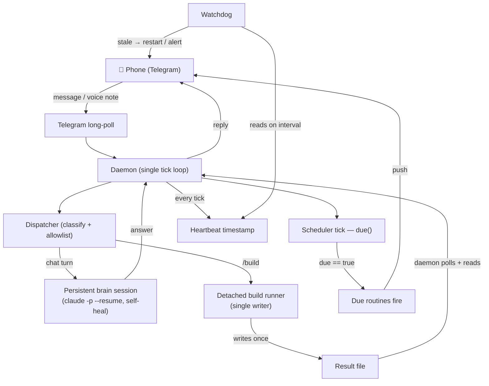

# Bow — Architecture

I built Bow as an all-Claude (Opus 4.8) chief-of-staff I can reach from my phone. The whole
system is a thin, disciplined wrapper around the headless `claude -p` CLI: instead of paying
metered API rates to call a model, Bow *is* a first-party Claude Code user, which is what keeps
the marginal cost at ≈ $0/mo over an existing flat-rate plan — versus a metered API agent, whose
bill is nonzero and recurring forever (an all-day assistant at even ~1M Opus-4.8 tokens/day of
mixed traffic runs into the low tens of dollars a month at current metered rates, climbing with
heavier build use). The cost framing is detailed in the README.

This document is the engineering substance: what each component owns, the non-obvious decisions
behind them, the data flow, and the four hard problems that actually cost me time. The numbers
below are verified against the build log — 16 package modules, 1,025 LOC of code against 1,339
LOC of tests, 101 test functions, across 6 shipped milestones. I directed and gated fleets of
Claude subagents (Fleet Mode) to implement and adversarially review every piece of it; that
orchestration is the part I'm proudest of and the part I'm putting on display.

Bow runs two real workloads in production: a daily scheduled quantitative job and a personal
knowledge base. Both are described generically on purpose — the point here is the architecture,
not the payloads.

---

## Components

One row per module group. Each row states the single responsibility it owns and the one
design decision that wasn't obvious until I hit the wall it solves.

| Component | Its one responsibility | The non-obvious decision |
|---|---|---|
| **Daemon + Telegram long-poll** | The single always-on loop: pull updates from Telegram, route each one, run the scheduler tick, emit a heartbeat. | The long-poll loop is the *only* event source. Everything — chat, builds, scheduled routines, proactive pushes — is funneled through one tick so there is exactly one thread of control to reason about. The tick must never block: a slow build or a Telegram outage that wedges the loop would (correctly) trip the watchdog. See [`snippets/daemon_resilience.py`](../snippets/daemon_resilience.py). |
| **Dispatcher** | Decide what an inbound message *is* (a chat turn, a `/build`, a `/send`, a voice note) and hand it to the right path. | Commands are gated by a chat allowlist, not by the model's judgment. The allowlist is the load-bearing security boundary in a single-user threat model — builds run with elevated permissions, so *who* can queue one is enforced deterministically before the model is ever invoked. |
| **Detached single-writer build runner** | Run an autonomous headless build to completion out-of-band, then report the result back to the phone. | A build can take minutes; the daemon ticks in seconds. The build is spawned **detached** so it outlives the tick that started it, and it is the **single writer** of its own result file. The daemon never writes that file — it only watches for it. This sidesteps a torn-write race I refused to ship. See [`snippets/single_writer_dispatcher.py`](../snippets/single_writer_dispatcher.py). |
| **Scheduler `due()`** | Decide, on each tick, which routines should fire right now (cron expression, interval, or daily time-of-day with optional weekday restriction). | The entire fire/don't-fire decision is a **pure function** — `due(schedule, last_run, now)` reads no clock and touches no I/O, so every scheduling edge case (double-fire, missed-fire-across-restart, the cron day-of-month-vs-day-of-week ambiguity) is unit-testable in isolation. I chose an in-daemon tick over per-routine OS-level timers: simpler, self-contained, and — for interval and daily routines — it catches up after the machine sleeps because `due()` re-evaluates on wake. Cron is the deliberate exception: a cron routine fires only inside its matching minute, so a job whose minute elapsed while the machine slept is not back-fired (a stale 9:30 cron run isn't replayed at 10:15). See [`snippets/scheduler_due.py`](../snippets/scheduler_due.py). |
| **Watchdog + heartbeat loop** | Detect a silent daemon death and self-restart / alert, independent of the daemon itself. | The daemon writes a heartbeat timestamp every tick; a separate watchdog reads it on a fixed interval and acts if it goes stale. Liveness is decided by an outside observer, not self-reported — a daemon that has hung can't report that it's healthy. (An early version crashed on a *missing* heartbeat by computing `int(inf)`; the adversarial review caught it before it shipped.) |
| **Brain / persistent session** | Hold a single durable conversation with continuity across daemon restarts. | Continuity comes from persisting the `--resume` session id to disk. Because a stored session id can be expired or pruned out from under me, a dead `--resume` **self-heals** into a fresh session instead of surfacing a raw "no conversation found" error to whoever is texting. Wrapping real `claude -p` means the brain inherits my skills, memory, and tools for free — no rebuild. See [`snippets/session_self_heal.py`](../snippets/session_self_heal.py). |

---

## The hard decisions

These four are the parts of the build that were genuinely non-obvious. Each one started as a
production failure or a security/concurrency hazard, not a design-doc bullet.

### 1. Relocating off a TCC-protected home directory

I first put the working tree under `~/Documents`. Under launchd, the daemon immediately failed
with **"Operation not permitted."** `~/Documents` is protected by macOS TCC (Transparency,
Consent, and Control), and a background launchd process doesn't carry the same consent grants an
interactive shell does. The fix was structural, not a flag: relocate the entire working tree to a
non-TCC home root. The lesson generalizes — on macOS, *where* a background process lives is part
of its security posture, and you find this out the hard way when a daemon that works by hand dies
under launchd.

### 2. launchd wrapper scripts, not `EnvironmentVariables`

The natural way to configure a launchd job is the `EnvironmentVariables` key in the plist. In my
context launchd effectively ignored it — the environment the daemon actually ran with wasn't the
one the plist declared. Rather than fight the plist, I switched to explicit **wrapper scripts**:
a small shell script per job that sets up the environment deterministically and then execs the
real entry point. The plist points at the wrapper. This also solved a second, subtler bug — the
daemon had been launching the system Python instead of the one that actually held the needed disk
access; the wrapper pins the exact interpreter, so the runtime under launchd matches the runtime
the tests run on, every time.

### 3. Headless `claude -p` authenticates where an interactive keychain unlock fails

The headline feature is autonomous builds. The intuitive path was to drive an *interactive*
`claude` session in a terminal multiplexer. That path is dead under launchd: a launchd-spawned
interactive `claude` **cannot unlock the keychain**, so it can't authenticate. The headless
`claude -p` CLI, by contrast, authenticates cleanly in exactly that context. So the architecture
is built on headless `-p` end to end — every chat turn and every build is a non-interactive
`claude -p` invocation. This is the decision that makes the whole "be the tool, don't call the
API" approach work: first-party CLI usage authenticates and bills under the flat-rate plan where
a raw API key would meter.

### 4. Detached single-writer builds

The obvious build design has the daemon and each build both writing one shared jobs file — the
daemon flips a job to "running," the build flips it to "done." Two processes writing one JSON file
with no lock is a torn write waiting to happen, and the failure mode is the worst kind:
intermittent, data-dependent, invisible until production. I refused to ship it. Instead each build
is **detached** (it outlives the spawning tick, so it never blocks the long-poll loop) and is the
**sole writer** of its own result file. The daemon is a pure reader: it polls for the result file
to appear and only then reads it and replies. One writer per file means there is no race to lose.
The full pattern, annotated, is in
[`snippets/single_writer_dispatcher.py`](../snippets/single_writer_dispatcher.py).

---

## Data flow

The shape to notice: a single tick loop is the only event source, the build path crosses a
process boundary through one file with one writer, and liveness is judged by an independent
watchdog rather than self-reported.

---

## Reliability posture

Three guards keep Bow running unattended, and each one exists because the adversarial QC pass
found the failure it prevents — not because I anticipated it on the happy path:

- **Routine isolation.** Routine dispatch runs *before* the update fetch on each tick, so an
  exception escaping the routine loop didn't just kill that routine — it soft-locked the entire
  daemon, every tick, forever, freezing Telegram too. Now each routine is isolated in its own
  try/except and `due()` reads its fields defensively, so one malformed config can't take the
  system down. See [`snippets/daemon_resilience.py`](../snippets/daemon_resilience.py).
- **Self-healing sessions.** A dead `--resume` session id falls back to a fresh session instead
  of erroring at whoever is texting. See [`snippets/session_self_heal.py`](../snippets/session_self_heal.py).
- **Best-effort delivery + watchdog.** A Telegram outage can't abort a poll, oversized replies
  are chunked rather than dropped, and an external watchdog restarts the daemon if the heartbeat
  goes stale.

I found these by running an independent adversarial QC pass over my own build — a fleet of Claude
reviewers I directed across six dimensions (correctness, concurrency, reliability, resource leaks,
workload safety, edge cases). It surfaced real bugs the unit tests missed, with zero critical
findings remaining after the fixes. That discipline — builder, then a *separate* refute-first
reviewer, then a deterministic gate before anything is called done — is the through-line of how
Bow was built. Default to a single agent: across my own runs, adding agents has a negative average
payoff; fan out only for read-heavy parallel work that demonstrably earns it. The full doctrine is
in [`docs/FLEET-MODE.md`](FLEET-MODE.md).
